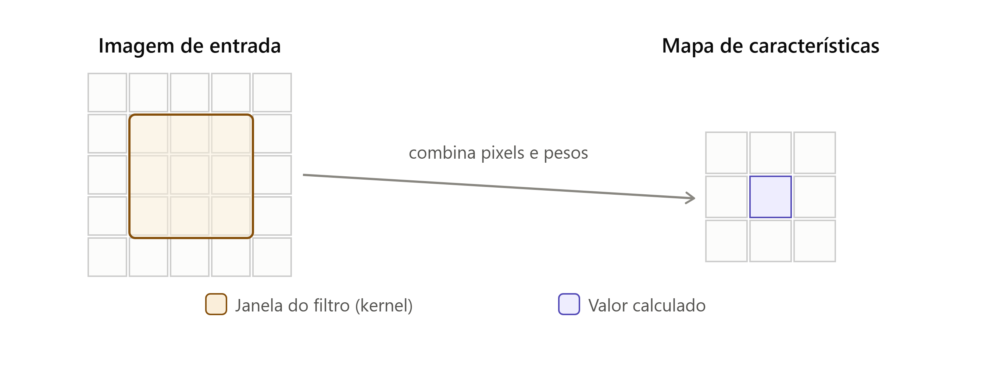
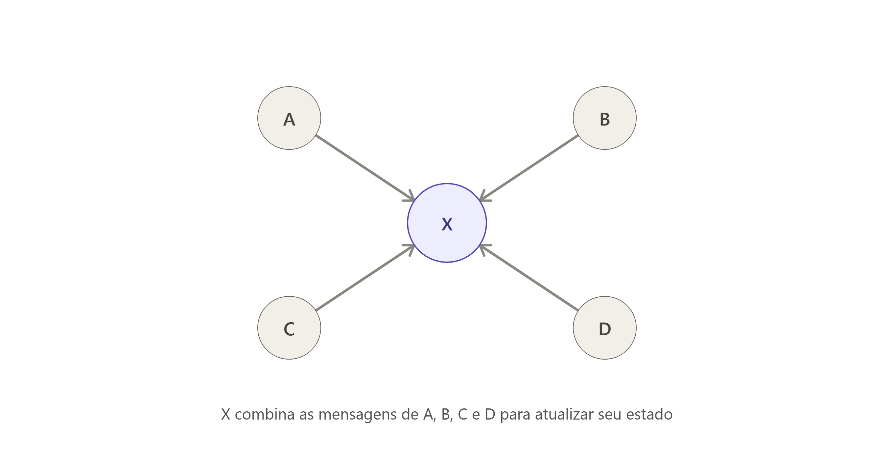

# Machine Learning: CNN vs GCN

## CNN

- Redes Neurais convolucionais (CNNs) são projetadas para processar dados que têm uma estrutura de grade (como imagens, por exemplo), sendo essencialmente usado em dados euclidianos.

- Elas utilizam operações de convolução para extrair características locais e são eficazes em tarefas de visão computacional.

- Podemos pensar numa CNN como uma lupa quadrada que desliza sobre uma imagem, em cada posição ela olha um pequeno bloco de pixels vizinhos (por exemplo 3x3), capturando padrões locais e combinando-os para formar uma representação global em uma mapa de características.
  - Isso é feito utilizando um filtro (kernel) que é aplicado a pequenas regiões da imagem, permitindo que a rede aprenda a detectar bordas, texturas e outros padrões visuais.

- O kernel desliza por toda a imagem, posição por posição, realizando operações de convolução que resultam em um valor calculado para cada posição, que é então armazenado em um mapa de características (feature map). É assim que um CNN aprende "isso é uma borda" ou "isso é um olho", sempre olhando vizinhos que estão fisicamente próximos.

## GCN
- Mas imagine que seus dados não formam uma grade regular (dados não-euclidianos), como redes sociais, moléculas ou grafos de conhecimento. Aqui não existem componentes (como pixels) que possam ser percorridos de forma sequencial ou em uma grade regular. É nesse contexto que entram as Redes Neurais Convolucionais em Grafos (GCNs).

- Uma GCN resolve isso trocando "vizinhos" por "vizinhos conectados". Em vez de olhar para pixels próximos, uma GCN olha para nós conectados em um grafo, permitindo que a rede aprenda representações de dados estruturados de forma não-euclidiana.

- Cada nó recebe uma "mensagem" de seus vizinhos conectados, e essas mensagens são agregadas para atualizar a representação do nó. Esse processo é repetido em várias camadas, permitindo que a GCN capture informações de vizinhos mais distantes.

- No exemplo acima, o nó X não olha uma janela fixa, mas sim para os nós que estão conectados a ele, sejam 2 ou 20 vizinhos. Depois de somar/combinar essas mensagens, X passa a armazenar informações sobre seus vizinhos, a informação se propaga por saltos cada vez mais distantes no grafo, permitindo que a GCN aprenda representações mais ricas e contextuais.

## Analogia direta

| CNN | GCN |
|-----|-----|
| Vinhança = janela fixa (3x3, 5x5)   | Vizinhança = quem está conectado no grafo     |
| Todo pixel tem a mesma quantidade de vizinhos     | Cada nó pode ter um número diferente de vizinhos    |
| Peso do filtro é compartilhado pela imagem inteira  | Regra de agregação é compartilhada por todos os nós    |
| Empilhar camadas amplia a região "vista" | Empilhar camadas amplia o alcance da rede (saltos no grafo) |